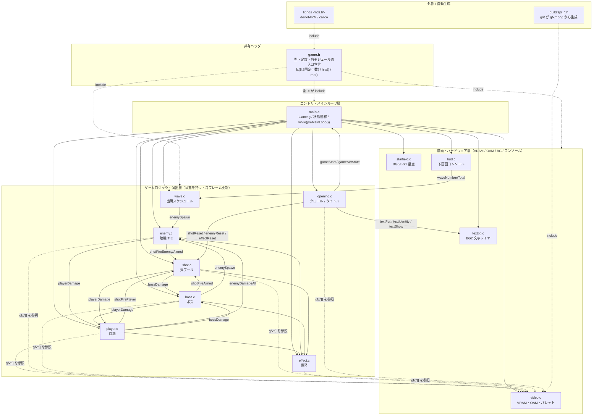
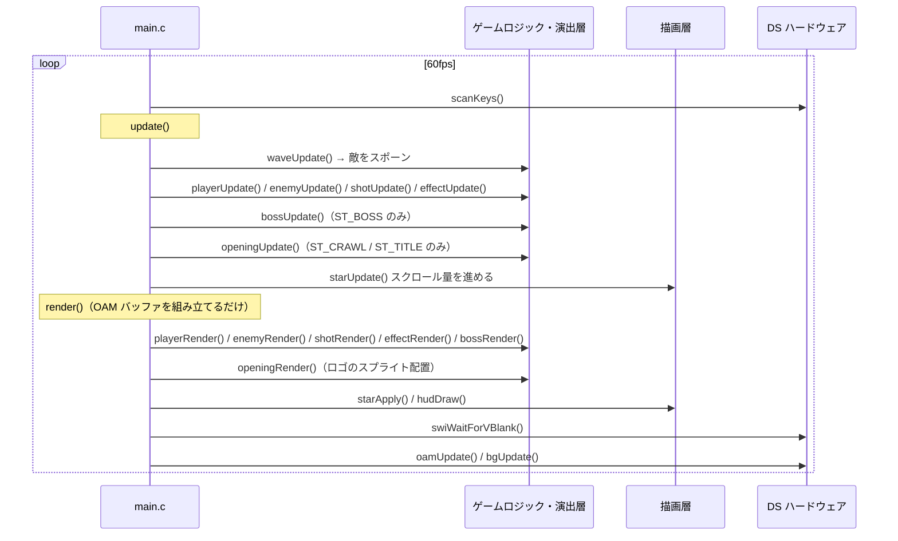
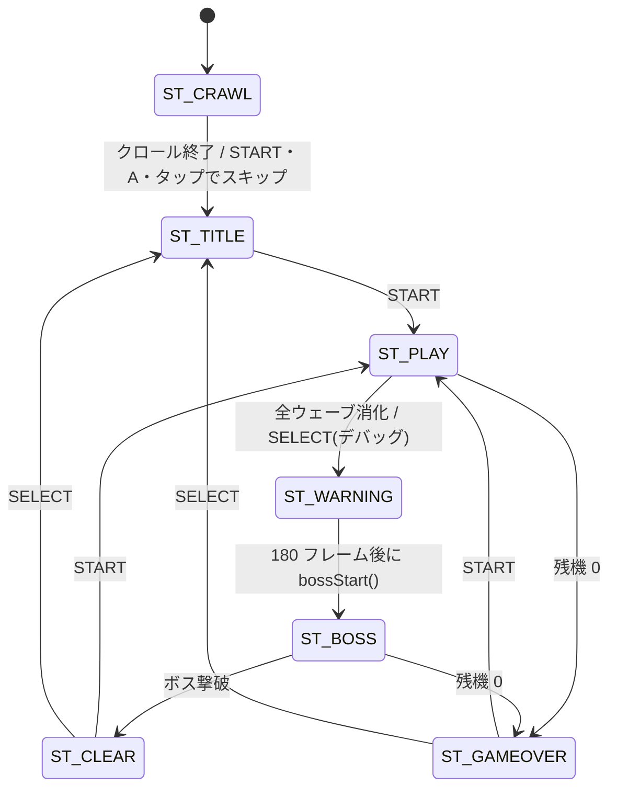
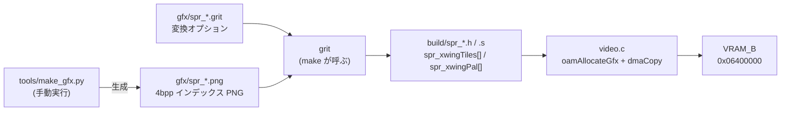

<div id="top"></div>

# X-WING

Nintendo DS (libnds) で書いた縦スクロールシューティング。
自機 X-wing、雑魚 TIE ファイター / TIE インターセプター、ボス TIE Advanced。
起動すると擬似 3D のオープニングクロールからタイトル画面へ流れます。

- **上画面**（メインエンジン）= ゲーム画面（星空 BG × 2 + 文字レイヤ + スプライト）
- **下画面**（サブエンジン）= HUD（テキストコンソール）

## 使用技術一覧

<p style="display: inline">
  <!-- 言語 -->
  
  
  <!-- SDK / ツールチェーン -->
  
  
  
  
  <!-- ターゲット / 実行環境 -->
  
  
  
</p>

| 分類 | 使っているもの | 役割 |
| ---- | -------------- | ---- |
| 言語 | **C**（C99 / `-O2`） | ゲーム本体。C++ は使っていないのでリンカは `CC` |
| SDK | **libnds 2.0.2** | DS のハードを叩くための API（`videoSetMode` / `oamSet` / `bgInit` …） |
| ツールチェーン | **devkitARM r68**（arm-none-eabi-gcc 16.1.0） | ARM9 向けクロスコンパイラ |
| ARM7 ランタイム | **calico 1.2.0**（`default-arm7`） | サウンド・入力・電源管理。既製バイナリをリンクするだけで自前実装なし |
| ビルド | **GNU Make** + `$(DEVKITARM)/ds_rules` | `.c` → `.o` → `.elf` → `ndstool` → `.nds` |
| 画像変換 | **grit 0.10.0** | `gfx/spr_*.png` → 4bpp タイル + 16 色パレットの C 配列 |
| ドット絵生成 | **Python 3**（`tools/make_gfx.py`） | 外部ライブラリなしで PNG を直接書き出す自作スクリプト |
| ROM 生成 | **ndstool 2.3.1** | `.elf` から `.nds` を組み立て |
| 実行環境 | **melonDS 1.1**（Windows 版を WSL から interop 起動） | 動作確認 |
| OS | **WSL2 / Ubuntu 24.04 LTS** | 開発環境 |

使っていないもの: maxmod（音）、dswifi、libfat / NitroFS、3D ハードウェア。
すべて 2D エンジンとスプライトだけで作っています。

## 目次

1. [遊び方](#遊び方)
2. [ディレクトリ構成](#ディレクトリ構成)
3. [アーキテクチャ](#アーキテクチャ)
   - [モジュール依存関係](#モジュール依存関係)
   - [レイヤの考え方](#レイヤの考え方)
   - [1 フレームの流れ](#1-フレームの流れ)
   - [状態遷移](#状態遷移)
   - [グラフィックスのビルドパイプライン](#グラフィックスのビルドパイプライン)
   - [画面レイヤと VRAM](#画面レイヤと-vram)
4. [ビルド方法](#ビルド方法)
5. [melonDS での起動](#melonds-での起動)
6. [コマンド一覧](#コマンド一覧)
7. [トラブルシューティング](#トラブルシューティング)

<br />
<div align="right">
    <a href="docs/design.md"><strong>設計メモ（調整箇所・踏んだ NDS の罠） »</strong></a>
</div>
<br />
<div align="right">
    <a href="docs/architecture.drawio"><strong>依存関係図（draw.io 版） »</strong></a>
</div>
<br />

## 遊び方

| 場面 | 入力 | 動作 |
| --- | --- | --- |
| オープニング（プロローグ / クロール） | START / A / 画面タップ | タイトルへスキップ |
| タイトル | START / A / 画面タップ | ゲーム開始 |
| プレイ中 | 十字キー | 8 方向移動 |
| プレイ中 | （自動） | ショットは常時発射 |
| プレイ中 | A | プロトンボム（敵弾を全消し + 画面内の敵に大ダメージ） |
| プレイ中 | START | ポーズ / 再開 |
| プレイ中 | SELECT | **デバッグ用**: ウェーブを飛ばしてボス戦へ |
| GAME OVER | START / SELECT | リスタート / タイトルへ |
| CLEAR | START / SELECT | もう一度 / タイトルへ |
| どこでも | L + R + SELECT | **デバッグ用**: タイトル画面へ戻る |
| どこでも | L + R + START | **デバッグ用**: オープニングを頭からやり直す |

ショットはスコアで自動的に強化されます（3,000 で LV.2、8,000 で LV.3）。
ボスは HP 残量で 3 フェーズに移行します。詳細は [docs/design.md](docs/design.md)。

<p align="right">(<a href="#top">トップへ</a>)</p>

## ディレクトリ構成

```
xwing/
├── Makefile                 # devkitPro テンプレート準拠。SOURCES=source / GRAPHICS=gfx を宣言するだけ
├── start.sh                 # make して melonDS で起動するまでのワンライナー
├── .clangd                  # エディタ補完用（libnds の include パスと -DARM9）
├── .gitignore
│
├── source/                  # ゲーム本体。すべて C（13 ファイル）
│   ├── game.h               #   ★共有ヘッダ: 型・定数・全モジュールの入口宣言
│   ├── main.c               #   初期化・状態遷移・メインループ（Game g を保持）
│   ├── video.c              #   VRAM バンク割り当て / スプライト画像とパレットの VRAM 転送
│   ├── starfield.c          #   視差スクロールする星空（BG0 = 手前 / BG1 = 奥）
│   ├── textbg.c             #   BG2（回転BG）の文字レイヤ。オープニングとタイトルが共有
│   ├── opening.c            #   プロローグ → 擬似 3D クロール → タイトル画面
│   ├── player.c             #   自機の移動・ショット・ボム・被弾
│   ├── shot.c               #   自機弾 / 敵弾のオブジェクトプールと当たり判定
│   ├── enemy.c              #   敵機の移動パターン・射撃・被弾
│   ├── boss.c               #   ボスのフェーズ管理と弾幕
│   ├── effect.c             #   爆発アニメーション
│   ├── wave.c               #   敵の出現スケジュール（stage[] テーブルを読むだけ）
│   └── hud.c                #   下画面のスコア / 残機 / ボス HP バー表示
│
├── gfx/                     # グラフィックス素材（make 時に grit が変換）
│   ├── spr_xwing.png/.grit  #   自機 32x32 × 3 コマ（通常 / 左バンク / 右バンク）
│   ├── spr_tie.png/.grit    #   敵機 16x16 × 2 種
│   ├── spr_boss.png/.grit   #   ボス 64x64
│   ├── spr_logo.png/.grit   #   タイトルロゴ 256x64（64x64 × 4 コマに分割）
│   ├── spr_shots.png/.grit  #   弾 8x8 × 4 種
│   └── spr_blast.png/.grit  #   爆発 16x16 × 4 コマ
│
├── tools/
│   └── make_gfx.py          # gfx/*.png をコードで描いて生成する（Pillow 等の依存なし）
│
├── docs/
│   ├── design.md            # 設計メモ・パラメータ調整箇所・踏んだ NDS の罠
│   └── architecture.drawio  # 依存関係図（draw.io / diagrams.net で開ける）
│
├── build/                   # 中間生成物（.o / .d / .map / grit が吐いた spr_*.h）
├── xwing.elf                # リンク結果
└── xwing.nds                # ★melonDS や実機に渡す ROM
```

> **命名の注意**: `gfx/` のファイル名に `spr_` を付けているのは、`source/boss.c` と
> `gfx/boss.png` が両方 `build/boss.o` になって衝突するのを避けるためです。
> `Makefile` は `SOURCES` と `GRAPHICS` の生成物を同じ `build/` に置くので、
> **拡張子違いの同名ファイルを作ってはいけません**。

<p align="right">(<a href="#top">トップへ</a>)</p>

## アーキテクチャ

### モジュール依存関係

draw.io で編集できる版は [docs/architecture.drawio](docs/architecture.drawio) にあります
（[diagrams.net](https://app.diagrams.net/) の `File > Open from > Device` で開けます）。
以下は同じ内容の Mermaid 版です。



### レイヤの考え方

| 層 | ファイル | 役割 | 依存の向き |
| --- | --- | --- | --- |
| 共有ヘッダ | `game.h` | 型（`fx`, `Player`, `Enemy`, `Boss`, `Shot`, `Game`）、OAM ID の割り当て、`hits()` / `rnd()` などの inline 関数、各モジュールの関数宣言 | すべての `.c` が include |
| エントリ | `main.c` | グローバル状態 `Game g` を持ち、状態に応じて下位モジュールの `*Update()` / `*Render()` を呼ぶ | ゲームロジック層・描画層へ一方向 |
| ゲームロジック・演出 | `player.c` `enemy.c` `boss.c` `shot.c` `effect.c` `wave.c` `opening.c` | 各自が自分の状態（`player`, `enemy[]`, `boss`, `pshot[]`, `eshot[]`）を `extern` なグローバルとして所有 | **同じ層どうしは相互に呼び合う** |
| 描画・ハード | `video.c` `starfield.c` `textbg.c` `hud.c` | VRAM / OAM / BG / サブ画面コンソールなど、libnds を直接叩く部分をここに閉じ込める | 上位を呼び返さない（`hud.c` の `waveNumber()` 参照のみ例外） |

設計上のポイント:

- **動的メモリ確保をしない。** 敵・弾・爆発はすべて固定長配列のオブジェクトプール（`MAX_ENEMY` = 16, `MAX_PSHOT` = 24, `MAX_ESHOT` = 40, `MAX_EFFECT` = 16）。
- **OAM（スプライト）ID も静的に割り当てる。** `game.h` で種類ごとに固定の範囲を予約し、合計 98 / 128 を使用。毎フレームの ID 争いが起きないので描画順が安定します。
- **`opening.c` だけは上位（`main.c` の `gameStart()` / `gameSetState()`）を呼び返します。** オープニング → タイトル → ゲーム開始という遷移を演出側が握っているためで、状態遷移の主導権をここに集約しています。
- **層をまたぐ依存は上から下の一方向**、同じ層の中は相互依存を許容。当たり判定は「弾 → 敵」「敵 → 自機」のように必ずどちらか一方のモジュールが持ちます（`shot.c` が自機弾 vs ボス / 敵弾 vs 自機、`enemy.c` が自機弾 vs 敵）。
- **座標と速度は 8.8 固定小数**（`typedef s32 fx`）。DS には FPU がないため。表示時だけ `fx2i()` で整数ピクセルに落とします。

### 1 フレームの流れ



`render()` は OAM の**バッファ**を書くだけで、実際の VRAM 反映は VBlank 後の
`oamUpdate()` / `bgUpdate()` にまとめています（描画中の書き換えによるちらつき防止）。

### 状態遷移



`ST_PLAY` / `ST_WARNING` / `ST_BOSS` の 3 状態は START でポーズできます。
`ST_CRAWL` は「プロローグ表示 → 擬似 3D クロール」の 2 フェーズを `opening.c` 内部で持ちます。

### グラフィックスのビルドパイプライン



- `.grit` の `-Mw` / `-Mh` はスプライト 1 枚のタイル数（32x32 なら `-Mw4 -Mh4`）。これを指定すると grit がスプライト用の 1D タイル順に並べてくれます。
- パレット index 0 はマゼンタ（`FF00FF`）で透過色に固定（`-gTFF00FF`）。
- 絵を描き替えるには **(a)** `tools/make_gfx.py` を編集して再生成、**(b)** `gfx/spr_*.png` を画像エディタで直接編集（16 色・index 0 = マゼンタを維持）、のどちらでも可。
- オープニングとタイトルの**文字**は画像ではなく、libnds のコンソールフォント（1bpp 8x8）を `textbg.c` が 8bpp タイルに展開して BG2 に貼っています。素材ファイルはありません。

### 画面レイヤと VRAM

ビデオモードは `MODE_2_2D`（BG0 / BG1 = テキスト BG、BG2 / BG3 = 回転 BG）。
割り当ては `video.c` の `gfxInit()` にまとまっています。

| バンク | 用途 | アドレス |
| --- | --- | --- |
| VRAM_A | メイン画面の BG（星空 2 枚 + 文字レイヤ） | `0x06000000` |
| VRAM_B | メイン画面のスプライト | `0x06400000` |
| VRAM_C | サブ画面（`consoleDemoInit()` が確保） | — |

VRAM_A 内のオフセット（`starfield.c` / `textbg.c` で手分けして使用）:

| オフセット | 中身 |
| --- | --- |
| `0x0000` / `0x0800` | 星空 BG のマップ 2 枚 |
| `0x1000` | 文字レイヤ（BG2）のマップ 4KB |
| `0x4000` | 星空 BG のタイル |
| `0xC000` | 文字レイヤのタイル 6KB |

| レイヤ | 優先度 | 内容 |
| --- | --- | --- |
| スプライト | — | 自機 / 敵 / 弾 / 爆発 / タイトルロゴ |
| BG2（回転 BG） | 1 | オープニングのクロールとタイトルの文字。HBlank 割り込みで行ごとに変形行列を差し替えて擬似 3D |
| BG0（テキスト BG） | 2 | 星空・手前 |
| BG1（テキスト BG） | 3 | 星空・奥（スクロール速度 1/3） |

<p align="right">(<a href="#top">トップへ</a>)</p>

## ビルド方法

### 前提

devkitPro が `/opt/devkitpro` に入っていること。未導入なら:

```bash
sudo dkp-pacman -S nds-dev
```

環境変数 `DEVKITPRO` / `DEVKITARM` が必要です（`/etc/profile.d/devkit-env.sh` で設定済み。
効いていなければシェルを開き直すか `source /etc/profile.d/devkit-env.sh`）。

```bash
echo $DEVKITARM      # → /opt/devkitpro/devkitARM
```

### ビルド

```bash
cd xwing
make
```

`build/` に中間ファイル、直下に `xwing.elf` と **`xwing.nds`** ができます。
melonDS や実機に渡すのは `.nds` のほうです。

ビルドの流れは `$(DEVKITARM)/ds_rules` 任せで、`Makefile` が宣言しているのは
`SOURCES := source` / `GRAPHICS := gfx` / `LIBS := -lnds9` だけです。

```
source/*.c ────────────arm-none-eabi-gcc──────────┐
                                                  ├──> build/*.o ──ld──> xwing.elf ──ndstool──> xwing.nds
gfx/*.png + gfx/*.grit ──grit──> build/spr_*.s ───┘
```

### ドット絵を作り直す場合

```bash
python3 tools/make_gfx.py    # gfx/*.png を再生成（標準ライブラリのみ）
make
```

### クリーンビルド

```bash
make clean && make
```

<p align="right">(<a href="#top">トップへ</a>)</p>

## melonDS での起動

melonDS は **Windows 版バイナリを WSL から interop 起動**しています。
Linux パスは渡せないので、`wslpath -w` で Windows パスに変換して引数に渡します。

```bash
MELONDS="/mnt/c/Users/ichi1/Downloads/melonDS-1.1-windows-x86_64/melonDS.exe"
"$MELONDS" "$(wslpath -w xwing.nds)"
```

ROM パスを引数で渡すと、BIOS / ファームウェアのブート画面を経由せず**ゲームが直接起動**します。

### ワンライナー

ビルドと起動をまとめた [start.sh](start.sh) を用意しています。

```bash
./start.sh
```

上画面に星空と X-wing、下画面に HUD が出れば成功です。START でゲーム開始。

### 毎回打つのが面倒な場合

`~/.bashrc` にシェル関数を置いておくと `dsmake` だけで済みます
（`alias` は引数を受け取れないので関数にすること）。

```bash
export MELONDS="/mnt/c/Users/ichi1/Downloads/melonDS-1.1-windows-x86_64/melonDS.exe"

dsrun() {
    local rom="${1:-$(basename "$PWD").nds}"   # 省略時はディレクトリ名から推測
    [ -f "$rom" ] || { echo "not found: $rom" >&2; return 1; }
    "$MELONDS" "$(wslpath -w "$rom")"
}

dsmake() { make && dsrun "$@"; }
```

`Makefile` が `TARGET := $(shell basename $(CURDIR))` としているため、
**ROM 名はディレクトリ名と一致**します（`xwing/` → `xwing.nds`）。

### キー割り当て

melonDS のデフォルトは以下です（`Config > Input and Hotkeys` で変更可）。

| DS | キーボード |
| --- | --- |
| 十字キー | 方向キー |
| A / B | A / B |
| X / Y | X / Y |
| START / SELECT | Enter / Backspace |

<p align="right">(<a href="#top">トップへ</a>)</p>

## コマンド一覧

| コマンド | 実行する処理 | 生成物 |
| -------- | ------------ | ------ |
| `make` | `source/*.c` をコンパイルし、`gfx/*.png` を grit で変換して ROM を作る | `build/*.o`, `xwing.elf`, `xwing.nds` |
| `make clean` | `build/` と `xwing.elf` / `xwing.nds` を削除 | — |
| `python3 tools/make_gfx.py` | ドット絵 `gfx/spr_*.png` を再生成 | `gfx/*.png` |
| `./start.sh` | `make` してから melonDS で `xwing.nds` を起動 | — |
| `ndstool -i xwing.nds` | 生成した ROM のヘッダ情報を表示 | — |
| `grit gfx/spr_xwing.png -ff gfx/spr_xwing.grit` | grit を単体で試す（変換結果の確認用） | — |
| `dkp-pacman -Q` | インストール済み devkitPro パッケージとバージョンの確認 | — |

<p align="right">(<a href="#top">トップへ</a>)</p>

## トラブルシューティング

より詳しい「踏んだ NDS の罠」は [docs/design.md](docs/design.md#踏んだ-nds-の罠) にまとめています。

### `Please set DEVKITARM in your environment.`

環境変数が未設定です。

```bash
source /etc/profile.d/devkit-env.sh
```

### `No rule to make target '/home/.../source/main.c', needed by 'main.o'.`

`build/` に残った `.d`（依存関係ファイル）が**移動前の絶対パス**を指しています。
リポジトリをディレクトリごと移動・リネームすると必ず起きます。

```bash
make clean && make
```

### melonDS が `Failed to open` で ROM を読めない

Linux パス（`/home/...`）をそのまま渡しています。Windows アプリなので変換が必要です。

```bash
"$MELONDS" "$(wslpath -w xwing.nds)"
```

### `!! bad ROM size ... (expected 262144) rounded to 262144`

melonDS の情報ログです。ROM サイズが 2 の冪でないだけで**エラーではありません**。

### 背景色しか出ない / 星空が表示されない

VRAM バンクをアドレスなしの名前（`VRAM_B_MAIN_BG`）で設定すると、スロット 1 =
`0x06020000` にマップされ、`bgInit()` の `mapBase` / `tileBase` が指す `0x06000000` が
未マップになります。**アドレス付きの名前を使ってください。**

```c
vramSetBankA(VRAM_A_MAIN_BG_0x06000000);
vramSetBankB(VRAM_B_MAIN_SPRITE_0x06400000);
```

### `dmaCopy()` したのに何も転送されない

DMA コントローラは CPU 内蔵メモリ（DTCM / ITCM）を読めません。ARM9 のスタックは DTCM 上に
あるため、**ローカル変数の配列を `dmaCopy()` してもエラーなく無視されます**。
`static` にしてメインメモリへ置き、CPU が書いた直後なら `DC_FlushRange()` でキャッシュを
フラッシュしてから DMA してください。

```c
static u8 tiles[256];
...
DC_FlushRange(tiles, sizeof(tiles));
dmaCopy(tiles, gfx, sizeof(tiles));
```

### タイトル画面が一瞬で飛ばされる

起動直後の 1 回目の `scanKeys()` は、キー入力レジスタが確定する前の値を拾って
「全キーが押された」と報告することがあります。メインループに入る前に空読みします。

```c
scanKeys();
scanKeys();
```

### エディタで `nds.h` が見つからないと言われる

clangd に devkitARM の include パスを教える必要があります。[.clangd](.clangd) を参照。

```yaml
CompileFlags:
    Add:
        - -I/opt/devkitpro/libnds/include
        - -I/opt/devkitpro/devkitARM/arm-none-eabi/include
        - -DARM9
```

<p align="right">(<a href="#top">トップへ</a>)</p>
